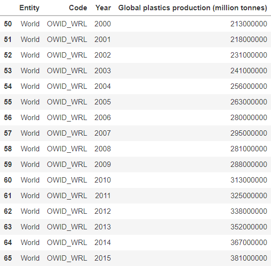
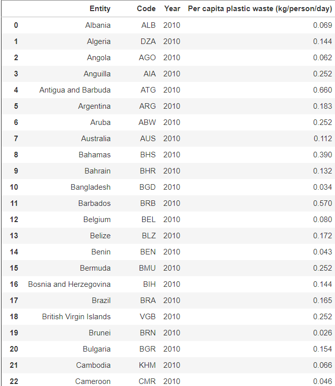
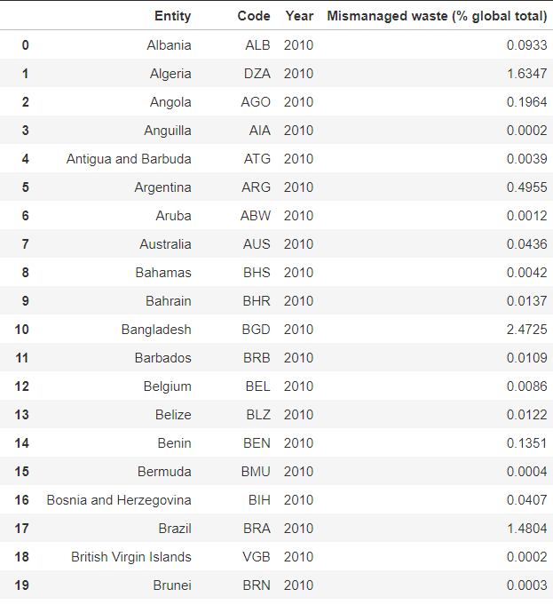

# Global Plastic Pollution Prediction

## Introduction
For this project, we wanted to examine the amount of plastic pollution that exists in our oceans, and be able to predict how large of an issue it will be in the future.

## Data Selection
Our data training is conducted using a Jupyter notebook found here (will link notebook). Our objective is to predict the amount of global plastic wasted per year for the next 20 years, and evaluate how much of an issue it presents. All of the datasets presented below can be found on [Kaggle](https://www.kaggle.com/sohamgade/plastic-datasets/version/1?select=global-plastics-production.csv) [1]. Using these datasets, we will be examining plastic usage from the year 2010. Our data consists of three primary datasets:

### Total Global Plastic Production
This data has 3 important features:
1. Entity (world in this case, since it's global)
2. Year
3. Amount of plastic (weighed in million tonnes)

This gives us a total amount of plastic that is produced by the year, and we are able to compare this data with our second dataset that involves individual countries.

Data Preview:

### Plastic Wasted Per Capita
This data has 3 important features:
1. Entity (country)
2. Year (will always be 2010 in this case)
3. Amount of plastic per capita wasted per person per day (weighed in kg)

This gives us individualistic data representing how much plastic is wasted per country. We can use this data in relation to our first dataset to start training our model in order to predict the amount of plastic that will be wasted per year for the next 20 years.

Data Preview:

### Global Mismanaged Plastic Waste
This data has 3 important features:
1. Entity (country)
2. Year (will always be 2010 in this case)
3. Percentage of mismanaged plastic waste for each country in the year 2010

This data allows us to give us a sense of how much plastic is mismanaged in each country as a whole, as opposed to individual people. This will help us determine how much plastic is wasted in the next 20 years, and just how much each country contributes to this waste.

Data Preview

## Methods

## Results

## Discussion

## Summary

## References
[1] [Plastic pollution datasets](https://www.kaggle.com/sohamgade/plastic-datasets/version/1?select=global-plastics-production.csv) (Kaggle)

## Contributors
- Chris D'Entremont
- Gabriel Madeira
- Dain Im
