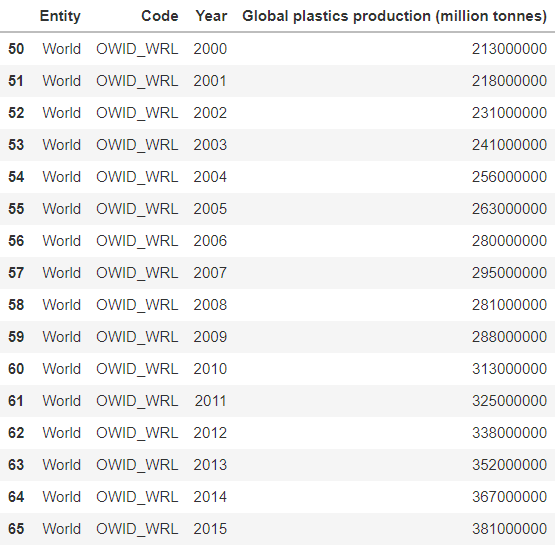
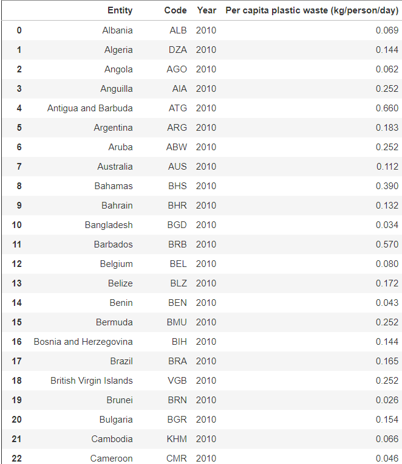
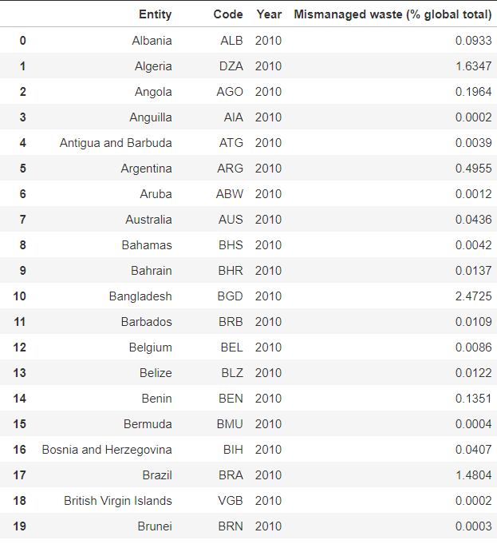
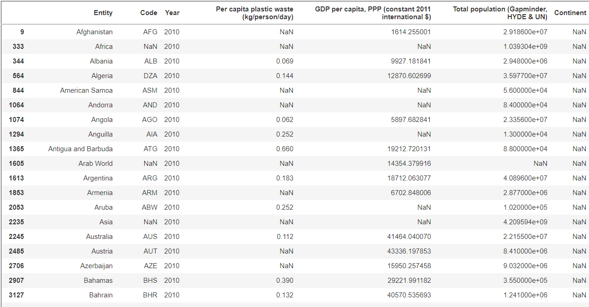
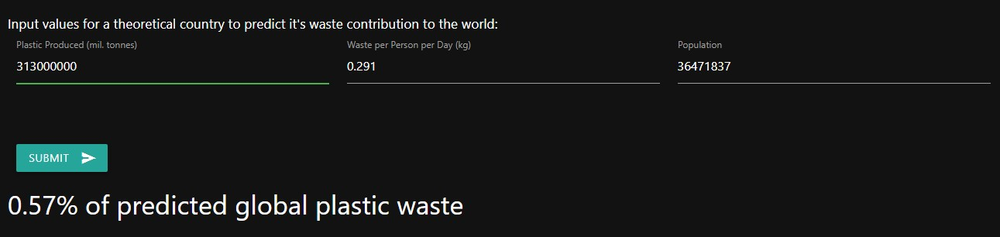

# Global Plastic Pollution Prediction

## Introduction
For this project, we wanted to examine the amount of plastic pollution that exists in our oceans, and be able to predict how large of an issue it will be in the future. To try and answer this, we worked to develop a [web application](https://dain.cafe/pollutionproj/) that allows you to input values for a theoretical country to see if the waste contribution would be a problem for the future.

## Data Selection
Our data training is conducted using a Jupyter notebook found here (will link notebook). Our objective is to create a machine learning model in which users can input hypothetical statistics representing population and waste, and get a result number representing the total percentage of wasted plastic. All of the datasets presented below can be found on [Kaggle](https://www.kaggle.com/sohamgade/plastic-datasets/version/1?select=global-plastics-production.csv) [1]. Using these datasets, we will be examining plastic usage from the year 2010. Our data consists of four primary datasets:

### Total Global Plastic Production
This data has 3 important features:
1. Entity (world in this case, since it's global)
2. Year
3. Amount of plastic (weighed in million tonnes)

This gives us a total amount of plastic that is produced by the year, and we are able to compare this data with our second and third datasets that involve individual countries and people. To be able to do this, we will be using the row indicating the year 2010.

Data Preview:

### Plastic Wasted Per Capita
This data has 3 important features:
1. Entity (country)
2. Year (will always be 2010 in this case)
3. Amount of plastic per capita wasted per person per day (weighed in kg)

This gives us individualistic data representing how much plastic is wasted per country. We can use this data in relation to our other two datasets to start training our model in order to predict the amount of plastic that will be wasted with given parameters.

Data Preview:

### Global Mismanaged Plastic Waste
This data has 3 important features:
1. Entity (country)
2. Year (will always be 2010 in this case)
3. Percentage of mismanaged plastic waste for each country in the year 2010

This data allows us to give us a sense of how much plastic is mismanaged in each country as a whole, as opposed to individual people. This will help us determine how much plastic is wasted with given parameters.

Data Preview

### Global Population For Each Country
This data has 1 important feature that we will be using - the population for each country.

The population data will give us an idea of how many people are in each country to be wasting plastic, so that our linear regression model can take this into account when predicting the plastic waste with given parameters.

Data Preview

## Methods
### Tools that were used:
- Numpy, Pandas, and Scikit-learn for data preparation and analysis
- Flask and nginx for web app deployment
- GitHub for reporting & demonstration
- VSCode with live server for web app development

### Scikit:
- Used multiple linear regression function to predict value given several defined values

## Results
Our prediction web application is live [here](https://dain.cafe/pollutionproj/). Users are able to input 3 features to predict how much plastic waste a theoretical country would contribute:
- Amount of plastic produced (million tonnes)
- Amount of plastic per capita wasted per person per day (weighed in kg)
- Population of theoretical country

The output value is a percentage of plastic waste that the theoretical country contributes to the world.

## Discussion
Since we were able to create an application where you can predict the global waste contribution, it's now possible to be able to see how much of a problem it could be in the future. By inputting what we think the population would be in the future along with how much plastic we think each person will waste and total plastic production based on previous data, we are able to come to this conclusion.

For example, the current U.S. population is 329,500,000. If around 400,000,000 million tonnes of plastic is generated in the year and a person in the U.S. wastes 0.335 kg of plastic per day, we can predict that the U.S. contributes to 4.11% of global plastic waste.

Our next step in this project would be to create a model that is able to predict these 3 features based on previous data. Once these features are able to be predicted, we can then predict the plastic waste contribution for a country in the next *x* years.

## Summary
Finding datasets that stated the population, total plastic production, and plastic wasted per person allowed us to create a machine learning model that is able to predict the percentage of plastic waste that a country would contribute. There are perspectives for future research using this information, including being able to predict the 3 features that allow us to predict the waste contribution.

## References
[1] [Plastic pollution datasets](https://www.kaggle.com/sohamgade/plastic-datasets/version/1?select=global-plastics-production.csv) (Kaggle)

## Contributors
- Chris D'Entremont
- Gabriel Madeira
- Dain Im
